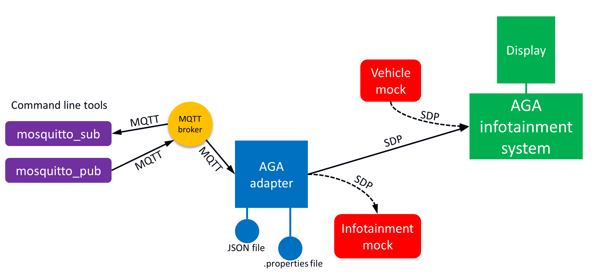

AGAAdapter - A MQTT to SDP adapter for the Automotive Grade Android (AGA) framework
====================================================================================

Introduction
------------
This AGAAdapter convert MQTT messages to SDP messages for use with the AGA infotainment framework. 

Automotive Grade Android (AGA) is an adaption of the Android platform for automotive 
infotainment use, to allow app developers to read vehicle signals. The car manufacturer 
needs to arrange sending the vehicle signals to AGA using the System Data Protocol 
(SDP), which runs over TCP/IP. SDP messages are identified by a 16-bit ID.

For more details see the [AGA documentation](https://developer.lindholmen.se/redmine/projects/aga/wiki). 
That page also describes how to download and install AGA, and contain links to the 
AGA source code (which has an Apache 2.0 license).

MQ Telemetry Transport (MQTT) is a protocol running over TCP/IP, and uses the publish-subscribe pattern. 
It uses a broker for routing messages from the publishers to the subscribers. 
See [Wikipedia](https://en.wikipedia.org/wiki/MQTT). 
The MQTT messages are sent on topics, allowing for selective subscription of messages. 
Prototyping is very easy when using MQTT, in part due to the availability of open source 
MQTT libraries, brokers and command line tools.

Mosquitto is one popular open source MQTT broker, and is recommended for use with this software. 
See the [Mosquitto documentation](http://mosquitto.org/). It also comes with the handy command line 
tools `mosquitto_pub` and `mosquitto_sub`. The Mosquitto page also describes the installation procedure.

This small AGAAdapter tool converts messages from the MQTT protocol to the SDP protocol, for experimenting with 
the AGA framework. It is only intended for prototyping, as it does not implement any security features. 
Note that the AGA framework only accepts a hard-coded subset of SDP signals. In order to change the 
AGA framework to accept your custom signals, you need to recompile the entire (AGA flavoured) Android platform.
This AGAAdapter does not help allowing more SDP signals to the AGA framework, but 
it simplifies sending the SDP signals.

AGAAdapter does not need to be running on the same machine as the AGA framework, as the communication
runs over IP network. It should be running on a Linux machine (not Android, without difficulties at least). 
As JAVA is cross platform, it might be possible to run also under Windows (not tested).
 

As seen in the drawing, this AGAAdapter tool converts incoming MQTT messages to outgoing SDP messages, 
which are sent to the AGA infotainment system. The AGAAdapter can also handle signal conversion 
in the opposite direction.

In order to verify the functionality of this software, the infotainment mock utility can be used. 
It is an command line utility that mimics the infotainment system from a SDP
communication point of view. It will print out received SDP messages (and is able to send SDP messages). 

Web resources
-------------
Source code on GitHub: [https://github.com/caran/agaadapter](https://github.com/caran/agaadapter)

Security
--------
This prototyping tool does not handle any permission settings. The MQTT broker has a per-user and per-topic authorization 
mechanism. In the AGA framework the read and write permissions (for the apps) are handled on a per-user and per-signal level.

The SDP protocol does not support encryption.

Installation
------------
Download the source code from Github:

    git clone https://github.com/caran/agaadapter.git

Build and run
-------------
The AGAAdapter accepts command line arguments, defining the configuration files
for signal conversion (.JSON) and for defining which IP ports to use etc (.properties).
The verbosity of the command line output can also be set.

Arguments:

* Conversion file in `.JSON` format. Mandatory.
* IP host and port definition file in `.properties` file format. See below for details. Optional. If not given, 
  the file `src/main/resources/agaadapter.properties` will be used.
* `-v` Increase the verbosity of the command line output.

Create a `.jar` file with all dependencies included:

    mvn package assembly:single

Run the AGAAdapter (requires built `.jar` file):

    java -jar {JAR-file} {Conversion-file} [Properties-file] [-v]

For example:

    java -jar target/agaadapter-1.0-SNAPSHOT-jar-with-dependencies.jar src/main/resources/conversion_example.json 
    
To specify also the .properties file:

    java -jar target/agaadapter-1.0-SNAPSHOT-jar-with-dependencies.jar src/main/resources/conversion_example.json src/main/resources/agaadapter.properties -v

Clean the build:

    mvn clean

Run tests
---------
Run unit tests:

    mvn test

In order to run the integration test, a MQTT broker needs to be running (but 
without any irrelevant traffic). Use:

    mvn integration-test 
    
The branch coverage is 100% except for the main AGAAdapter class, which has 
a 96% coverage. The code not covered is logging messages, mainly for 
informing on different types of MQTT connection errors etc. 

Usage
-----
First of all you need to have a MQTT broker running. Install the Mosquitto broker
according to the link above.

To try out the functionality of the AGAAdapter, run it like described above using 
the `conversion_example.json` file. If running the MQTT broker on localhost you 
can most often use the default `.properties` file.

The SDP output from the AGAAdapter is easily monitored using the infotainment 
mock utility provided in this repository. See below for instructions.

Send MQTT messages to the AGAAdapter using the command line application moqsuitto_pub.
This is described below.

When sending a MQTT message to the AGAAdapter from `moqsuitto_pub`, it will be 
converted to a SDP message and displayed in the infotainment mock.

Change the configuation files to match your signal conversion needs.

Build API documentation in HTML format. This also include test coverage reports etc.
------------------------------------------------------------------------------------
To build the API documentation together with test coverage reports etc, use: 

    mvn site
    
The result ends up in `target/site/`.

For this to be functional, the integration tests must be passing. This implies that a MQTT broker is running.
If you need to build the HTML API documentation (javadoc only) without having passing unittests, use:

    mvn javadoc:javadoc

Build API documentation in PDF format. This also include test coverage reports etc.
------------------------------------------------------------------------------------
To build the API documentation in PDF format, on Linux:

    source generatepdf.sh 

The resulting file ends up in `target/site/`.

This requires that also the markdown, pdfunite and wkhtmltopdf tools are installed. 
On Ubuntu they can be installed using:

    sudo apt-get install markdown wkhtmltopdf poppler-utils

Configuration file format
-------------------------
There are two configuration files for the AGAAdapter, one for setting the IP addresses etc, and one for 
setting the signal conversion.

The file for IP hosts/numbers and port numbers is in the `.properties` file format. The content should be like this:

    AGA_host=localhost
    AGA_port=8251
    MQTT_host=localhost
    MQTT_port=1883

The signal conversion file is in the `.JSON` file format. It contains an object with a list named `signals`. 
Each signal is an object with the fields `agaId`, `agaType`, `agaName`, `agaMultiplier`, `mqttTopic`, `toAga`, `fromAga`. 
An example is given below:

    {"signals":[
        {
          "agaId": 11,
          "agaType": "INTEGER",
          "agaName": "TESTSIGNAL1",
          "mqttTopic": "command/canadapter/testsignal1",
          "fromAga": true
        },
        {
          "agaId": 262,
          "agaType": "FLOAT",
          "agaName": "FMS_ENGINE_SPEED",
          "mqttTopic": "data/canadapter/enginespeed",
          "toAga": true
        }
    ]}

The details of the fields are given in the table below:

    | Key           |  Value type  |  Mandatory | Description                                                                   |
    |---------------|--------------|------------|-------------------------------------------------------------------------------|
    | agaID         | integer      | Yes        | Signal number as defined by AGA.                                              |
    | agaType       | string       | Yes        | Signal data type, as defined by AGA. Allowed values: see below.               |
    | agaName       | integer      | No         | This is a documentation feature, and is at present not used by this software. |
    | agaMultiplier | float        | No         | Multiplication of signals originating from AGA. Defaults to 1.0 if not given. |
    | mqttTopic     | string       | Yes        | Topic for the MQTT message.                                                   |
    | toAga         | boolean      | No         | Wheter MQTT-to-SDP conversion is allowed. Defaults to false.                  |
    | fromAga       | boolean      | No         | Wheter SDP-to-MQTT conversion is allowed. Defaults to false.                  |

The agaType field should be one of:

* "UINT8"
* "SHORT"
* "INTEGER"
* "FLOAT"
* "DOUBLE"

The agaMultiplier field is a conversion multiplier used for signals originating from AGA (in SDP format). 
A signal originating from MQTT is instead divided by that field. 
The agaMultiplier should be larger than zero (strictly positive).

For example, a MQTT signal describing a vehicle speed in m/s must be multiplied with 3.6
in order to be sent as a AGA SDP signal in km/h. The way the agaMultiplier field is defined, it must be set 
to 0.2778 (which is 1/3.6) in this particular case. 

License
-------
This software is released under the BSD 3-clause license. See the LICENCE.md file.

Dependencies
------------

    | Dependency                 | Description                         | License                            |
    |----------------------------|-------------------------------------|------------------------------------|
    | Java 6 to 8                | Virtual machine and compiler        | Oracle Binary Code License         |
    | Apache Maven 3.0.5         | Build tool                          | Apache 2.0 license                 | 
    | gson 2.3.1                 | Parsing library for JSON files      | Apache 2.0 license                 | 
    | slf4j-simple 1.7.7         | Logging framework                   | MIT license                        | 
    | Paho Java Client 1.0.1     | MQTT client library                 | Eclipse Public License 1.0         | 
    | SDP 1.3                    | SDP protocol library                | Apache 2.0 license                 | 
    | Mosquitto (all versions)   | One of many useful MQTT brokers     | BSD 3-clause license               | 
    | (several maven plugins)    | Maven helper plugins. See POM file. | Apache 2.0 license                 | 
 

    | Testing dependency         | Description                         | License                            |
    |----------------------------|-------------------------------------|------------------------------------|
    | junit 4.12                 | Unit testing framework              | Eclipse Public License 1.0         | 
    | hamcrest-core 1.3          | Matching tools used by junit        | BSD 3-clause license               | 
    | system-rules 1.3.0         | Stefan Birkner's JUnit rules        | Common Public License 1.0          | 
    | markdown 1.0.1             | HTML generation tool                | BSD 3-clause license               | 
    | mosquitto-clients 1.3.5    | MQTT command line utilities         | BSD 3-clause license               | 
    | cobertura 2.1.1 *          | Code coverage mesaurement tool      | GPL                                | 
    | wkhtmltopdf 0.9.9 *        | HTML to PDF conversion tool         | LGPLv3                             |
    | pdfunite 0.24.5 *          | PDF page merger                     | GPL                                |

None of the dependencies are distributed in this repository. You need to install Java and Maven yourself, but 
the rest of the dependencies are downloaded by Maven automatically.

\* Cobertura, wkhtmltopdf and pdfunite are GPL/LGPL-licensed tool for measuring code coverage and to generate documentation. 
They are not part of AGAAdapter, and are not used by AGAAdapter. 

Make sure that your usage of AGAAdapter complies with all the licensing requirements. 

Developer information
---------------------
Use "Github-flavoured Markdown" formatting for this documentation.

Maven is used as the build system. All settings are done in the `.POM` file (project object model).

The integration tests are executed with the "maven-failsafe-plugin" helper. Any files containing for example `**/*IT.java`
are considered integration tests. 

It seems that the PDF generation plugin does not work for Maven 3.

Build this README in HTML format
--------------------------------
This README file is written in Markdown, which is a format designed to be easy to read for human eyes 
also in raw format. However, if you like to build it in HTML format, use:

    markdown README.md > readme.html
    

Manual testing of the AGAAdapter: SDP signals
----------------------------------------------
In order to verify the functionality of this software, the infotainment mock utility 
(receives vehicle signals) can be used. 
It will display received SDP messages (and can send SDP messages).

To verify the AGA infotainment system and the TCP/IP connection to it, the vehicle mock utility 
(sends vehicle signals) can be used. 
It will send SDP messages (scriptable) to the AGA infotainment system, 
and display SDP messages sent from the AGA infotainment system.

Both the infotainment mock utility and the vehicle mock utility are scriptable, and the IP-numbers and 
IP ports can be set. These details are set in the source code (hardcoded), but are very easy to adjust. 
Change the source accordingly, and recompile using the maven command below.

Compile mocks:

    mvn test-compile

Run the simulated (mock) AGA infotainment system (requires compiled mocks):

    mvn exec:java -Dexec.mainClass="com.caran.agaadapter.AGAInfotainmentMock" -Dexec.classpathScope="test"

Run the simulated (mock) vehicle (requires compiled mocks):

    mvn exec:java -Dexec.mainClass="com.caran.agaadapter.AGAVehicleMock" -Dexec.classpathScope="test"

There are also bash scripts containing the last two commands (in the root folder of this project).

Manual testing of the AGAAdapter: MQTT signals
-----------------------------------------------

The MQTT part can be tested using MQTT command line clients `mosquitto_pub` and `mosquitto_sub` in Linux, 
for sending and receiving MQTT messages respectively. Run this in a terminal to view all MQTT messages:

    mosquitto_sub -v -t +/#
    
To send messages on specific topics:
    
    mosquitto_pub -t data/canadapter/vehiclespeed -m 32
    mosquitto_pub -t data/canadapter/enginespeed -m 1700

Verification of the verification tools
--------------------------------------
The infotainment mock utility (receives vehicle signals) is a verification tool 
for testing the AGAAdapter. In order to verify this mock utility, it is possible 
to use the "Automotive Grade Android Simulator", provided by the AGA team.

It is a Windows application that can send SDP messages. 

* Install and start the "Automotive Grade Android Simulator". See AGA documentation.
* Start the infotainment mock utility (provided in this repository), see above. 
  Make sure that is subscribes to a few well known signals, for example 262 (dec) 
  Engine Speed and 320 (dec) Wheel Based Speed.
* In the "Automotive Grade Android Simulator" enter the IP number of the machine 
  running the infotainment mock utility. Press "Connect".
* When connected (blue indicator), add the signal Engine Speed using the button
  "Add/Remove Signal) and the option "From database".
* Press "Play" icon and drag the corresponding slider.

Sometime it seems to be OK for the Windows firewall to initiate outgoing SDP 
communication on port 8251. Otherwise you need to adjust the firewall settings.

Measure code coverage
---------------------
Generate unit test code coverage report:

    mvn cobertura:clean cobertura:cobertura 
    firefox ./target/site/cobertura/index.html &

Generate unit and integration test code coverage report:

    mvn cobertura:clean cobertura:cobertura-integration-test
    firefox ./target/site/cobertura/index.html &

Create separate JAR files with the compiled class files, the source files and the javadocs
------------------------------------------------------------------------------------------
Use:

    mvn package
    
    
Create a JAR file with all the project report HTML files etc
------------------------------------------------------------
Use:

    mvn site:jar

Create a project ZIP file with all source files, README, documentation images etc
---------------------------------------------------------------------------------
To create the `.zip` file:

    mvn package assembly:single

It will end up in the `target` directory.

Authors
-------
This is part of the Caran Open Source Portal, by Semcon. 
See [Caran Open Source Portal](http://www.caran.com)

Contact us at <caranopensource@semcon.com>

Acknowledgements
----------------
Niklas Melleg&aring;rd at Viktoria Swedish ICT has provided invalueable help with the SDP communication.

TODO
----
* 

